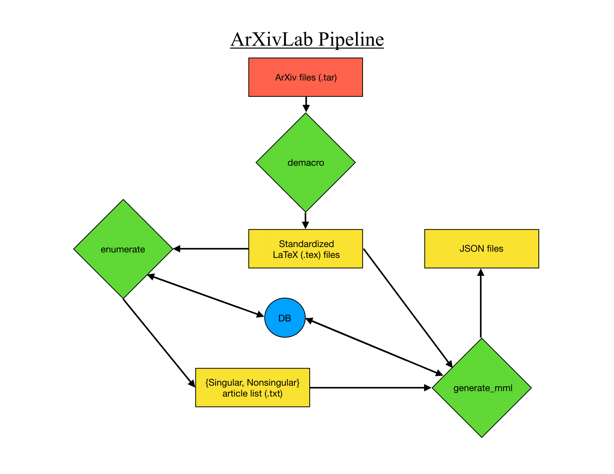

# hoptex

This folder and its associated scripts can be used for the large-scale processing & feature extraction of .tex documents.

All scripts have argparse, which you should check using `-h` for more specific use cases.

The primary conversion pipeline (master.py) is as follows:

## Main pipeline

### demacro.py
Usage:`python3 demacro.py /path/to/input /path/to/output`

Accepts a number of different inputs (.tar, .tar.gz, folders of .tex files, individual .tex files), and substitutes macros with standardized LaTeX. Currently, coverage over the arxiv corpus is >99.4% of all documents.

It handles:
* def
* newcommand/renewcommand
* DeclareMathOperator
* input

Conversion of the entire arxiv corpus (60+ GB) to standard LaTeX with a 120s document timeout (which is customizable) took 8 hours on a 28-core machine.

### convertlatex.py

Usage:`python3 convertlatex.py /path/to/tex/dir /path/to/xhtml/dir/`

convertlatex.py accepts a directory of .tex files, and generates a folder of xhtml files, each of which contains only equations, in the MathML format. If the math for a file takes longer than 60 seconds to process (often the case of latexml becoming unresponsive and/or leaking memory), it aborts the attempt to generate an xhtml file for that document file and prints a corresponding note of failure to stderr. It also creates an error folder (in the same folder as the output directory), which contains the sanitized version of the .tex file.

Each xhtml file is generated using the *latexml* and *latexmlpost* commands. Note that you *must* have these installed for this script to run properly (see below for installation details).

convertlatex.py uses the multiprocessing library and, by default, will utilize as many cores as your system has.

### proctex.py

Usage:`python3 proctex.py /path/to/tex/dir /path/to/xhtml/dir/ /path/to/json/output/dir`

proctex.py accepts a directory of .tex files, the corresponding directory of converted .xhtml files, and an output directory.

It generates JSON objects. Each JSON object contains the following:
* Text before
* Text after
* LaTeX text
* converted MathML (if applicable)
* Filename
* Equation number (in document)

### enumerate_eqs.py

Usage: `python3 enumerate_eqs.py /path/to/tex/dir /path/to/output.tsv`

Optional flags:
* `--TSV` - enables you to use/build on a previously generated TSV's enumeration.
* `--XHTML` - path to XHTML files, adds an additional column to TSV with the XHTML of that equation (deprecated, see generatetsv.py)

This script generates a TSV, where each of the columns are as follows:
* EQID (unique to equation)
* sub_EQIDs (only for multiline display mode equations)
* Masked, standardized LaTeX (for storage in the TSV - use unmask in core/funcs.py to restore to normal)

The masked, standardized LaTeX has all labels and equation mode specific whitespace removed, and the delimiters have been replaced with \\begin{equation} and \\end{equation}.

### enumerate_docs.py

Usage: `python3 enumerate_docs.py /path/to/tex/dir /path/to/corresponding/enum_eqs.tsv`

Optional (or not-so-optional) flags:
* `--outpath [path]` - Directory to write out the enumerated documents to. **If this is not specified, then the script will overwrite the .tex files in place**
* `--inline` - Use this flag if you're enumerating inline equations with a tsv from the correspondingly-named enumerate_inline_eqs.py

This script will replace all instances of an equation across the aforementioned documents with its corresponding equation ID.

### striplatex.py

Usage: `python3 striplatex.py /input/tex/dir /output/tex/dir`

This script removes all LaTeX from a folder of .tex files, and writes them to the output directory. After running enumerate_docs.py and this script, the generated .txt3 files are relatively ready for natural language text processing/analysis (e.g. for use with TF-IDF, or K-means clustering).

As standalone components:
* mse.py can generate images or just the MathML of the most significant equation in demacro'd .tex files
* renderimage.py can render the flattened equations from TSVs generated by enumerate_eqs.py and enumerate_inline_eqs.py to png using `latexmlmath`
* getarxivdata.py accepts a directory of .tex files, and in the parent directory of those .tex files, generates a metadata file of all of the files and their categories (NOTE: currently being rewritten)

###### Installation/usage

These scripts require Python 3.4.3+.

convertlatex.py relies on LaTeXML being installed, as follows:

> `git clone https://github.com/brucemiller/LaTeXML.git`

**Make sure you have LaTeXML's prerequisites installed** (http://dlmf.nist.gov/LaTeXML/get.html).

cd into the LaTeXML directory and make/test LaTeXML (continuing from above):

> `cd LaTeXML`

>`perl Makefile.PL`

>`make`

> `make test`

If all goes smoothly, convertlatex.py should now be able to convert.
